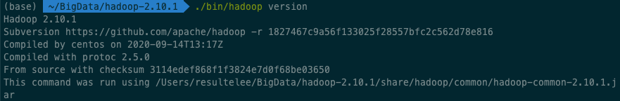
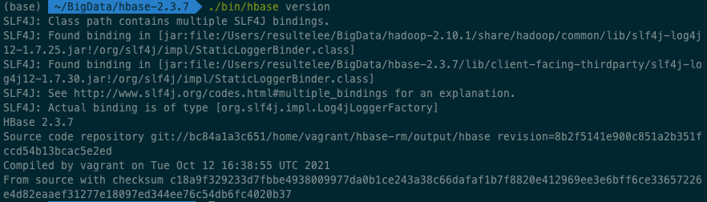
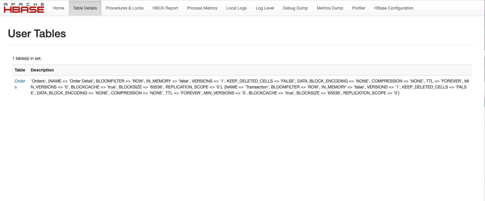

# operate-hbase-with-java-api
使用Java API操作Hbase

实现以下操作：

- 在HBase中创建一张表，名为“Orders”，存储每一条订单记录。
- 该表包括两个列族，“OrderDetail”与“Transaction”。
- “OrderDetail”包括“consumerId”，“itemId”，“itemCategory”，“amount”，“money”
- “Transaction”包括“createTime”，“paymentTime”，“deliveryTime”,“CompleteTime”
- 同时向“Orders”表中加入若干数据。

步骤如下：

### 1. 下载并启动Hadoop

官网下载[Hadoop2.10版本](https://www.apache.org/dyn/closer.cgi/hadoop/common/hadoop-2.10.1/hadoop-2.10.1.tar.gz)

安装后解压，并测试`./bin/hadoop version`，输出结果如下：



启动Hadoop`./sbin/start-dfs.sh`

### 2. 下载并启动HBase

官网下载[Hbase2.3.7版本](https://hbase.apache.org/downloads.html)

安装后解压，并测试`./bin/hbase version`，输出结果如下：



启动Hbase`./bin/start-hbase.sh`

### 3. 编写并运行Java代码

首先创建Orders表 & 创建Order Detail和Transaction两个列族：

```java
Configuration conf = HBaseConfiguration.create();
conf.set("hbase.rootdir","hdfs://localhost:9000/hbase");
conf.set("hbase.cluster.distributed","true");

Connection connection = ConnectionFactory.createConnection(conf);

HBaseAdmin admin = (HBaseAdmin)connection.getAdmin();

// 创建Orders表 & 创建Order Detail和Transaction两个列族
TableDescriptorBuilder tdb = TableDescriptorBuilder.newBuilder(TableName.valueOf("Orders"));
List<ColumnFamilyDescriptor> listColumns = new ArrayList<>();
ColumnFamilyDescriptor cfd_info = ColumnFamilyDescriptorBuilder.newBuilder("Order Detail".getBytes()).build();
ColumnFamilyDescriptor cfd_res = ColumnFamilyDescriptorBuilder.newBuilder("Transaction".getBytes()).build();
listColumns.add(cfd_info);
listColumns.add(cfd_res);
tdb.setColumnFamilies(listColumns);
TableDescriptor td= tdb.build();
admin.createTable(td);
```

然后依次在表中加入数据：

```java
// 表中加入数据
HTable table = (HTable) connection.getTable(TableName.valueOf("Orders"));
Put put=new Put("000001".getBytes());
put.addColumn("Order Detail".getBytes(),"consumerId".getBytes(),"41341".getBytes());
put.addColumn("Order Detail".getBytes(),"itemId".getBytes(),"1057499".getBytes());
put.addColumn("Order Detail".getBytes(),"itemCategory".getBytes(),"2".getBytes());
put.addColumn("Order Detail".getBytes(),"amount".getBytes(),"1".getBytes());
put.addColumn("Order Detail".getBytes(),"money".getBytes(),"462.8".getBytes());
put.addColumn("Transaction".getBytes(),"createTime".getBytes(),"2020-4-16 9:21:09".getBytes());
put.addColumn("Transaction".getBytes(),"paymentTime".getBytes(),"2020-4-16 10:14:47".getBytes());
put.addColumn("Transaction".getBytes(),"deliveryTime".getBytes(),"2020-7-9 2:12:23".getBytes());
put.addColumn("Transaction".getBytes(),"CompleteTime".getBytes(),"2020-7-28 12:10:40".getBytes());
table.put(put);
```

循环上述过程，直至把全部数据（8条行健数据）加入表中。

最后运行Java代码。

### 4. 输出结果

在 hbase shell中的输出结果如下：

```shell
hbase(main):015:0> list
TABLE
Orders
1 row(s)
Took 0.0292 seconds
=> ["Orders"]
```

```she
hbase(main):016:0> scan 'Orders'
ROW                                COLUMN+CELL
 000001                            column=Order Detail:amount, timestamp=2021-12-25T17:50:42.217, value=1
 000001                            column=Order Detail:consumerId, timestamp=2021-12-25T17:50:42.217, value=41341
 000001                            column=Order Detail:itemCategory, timestamp=2021-12-25T17:50:42.217, value=2
 000001                            column=Order Detail:itemId, timestamp=2021-12-25T17:50:42.217, value=1057499
 000001                            column=Order Detail:money, timestamp=2021-12-25T17:50:42.217, value=462.8
 000001                            column=Transaction:CompleteTime, timestamp=2021-12-25T17:50:42.217, value=2020-7-28 12:10:40
 000001                            column=Transaction:createTime, timestamp=2021-12-25T17:50:42.217, value=2020-4-16 9:21:09
 000001                            column=Transaction:deliveryTime, timestamp=2021-12-25T17:50:42.217, value=2020-7-9 2:12:23
 000001                            column=Transaction:paymentTime, timestamp=2021-12-25T17:50:42.217, value=2020-4-16 10:14:47
 000002                            column=Order Detail:amount, timestamp=2021-12-25T17:50:42.239, value=0
 000002                            column=Order Detail:consumerId, timestamp=2021-12-25T17:50:42.239, value=32805
 000002                            column=Order Detail:itemCategory, timestamp=2021-12-25T17:50:42.239, value=4
 000002                            column=Order Detail:itemId, timestamp=2021-12-25T17:50:42.239, value=9203020
 000002                            column=Order Detail:money, timestamp=2021-12-25T17:50:42.239, value=760.3
 000002                            column=Transaction:CompleteTime, timestamp=2021-12-25T17:50:42.239, value=2020-9-22 6:58:44
 000002                            column=Transaction:createTime, timestamp=2021-12-25T17:50:42.239, value=2020-3-17 0:17:19
 000002                            column=Transaction:deliveryTime, timestamp=2021-12-25T17:50:42.239, value=2020-7-4 21:13:27
 000002                            column=Transaction:paymentTime, timestamp=2021-12-25T17:50:42.239, value=2020-3-17 1:15:04
 000003                            column=Order Detail:amount, timestamp=2021-12-25T17:50:42.250, value=9
 000003                            column=Order Detail:consumerId, timestamp=2021-12-25T17:50:42.250, value=66772
 000003                            column=Order Detail:itemCategory, timestamp=2021-12-25T17:50:42.250, value=5
 000003                            column=Order Detail:itemId, timestamp=2021-12-25T17:50:42.250, value=6330669
 000003                            column=Order Detail:money, timestamp=2021-12-25T17:50:42.250, value=97
 000003                            column=Transaction:CompleteTime, timestamp=2021-12-25T17:50:42.250, value=2020-7-1 8:27:19
 000003                            column=Transaction:createTime, timestamp=2021-12-25T17:50:42.250, value=2020-4-6 11:34:17
 000003                            column=Transaction:deliveryTime, timestamp=2021-12-25T17:50:42.250, value=2020-5-10 10:18:01
 000003                            column=Transaction:paymentTime, timestamp=2021-12-25T17:50:42.250, value=2020-4-6 11:37:04
 000004                            column=Order Detail:amount, timestamp=2021-12-25T17:50:42.263, value=4
 000004                            column=Order Detail:consumerId, timestamp=2021-12-25T17:50:42.263, value=59086
 000004                            column=Order Detail:itemCategory, timestamp=2021-12-25T17:50:42.263, value=4
 000004                            column=Order Detail:itemId, timestamp=2021-12-25T17:50:42.263, value=5544997
 000004                            column=Order Detail:money, timestamp=2021-12-25T17:50:42.263, value=550.1
 000004                            column=Transaction:CompleteTime, timestamp=2021-12-25T17:50:42.263, value=2020-9-13 15:47:28
 000004                            column=Transaction:createTime, timestamp=2021-12-25T17:50:42.263, value=2020-3-26 22:29:44
 000004                            column=Transaction:deliveryTime, timestamp=2021-12-25T17:50:42.263, value=2020-7-5 10:09:26
 000004                            column=Transaction:paymentTime, timestamp=2021-12-25T17:50:42.263, value=2020-3-26 22:51:19
 000005                            column=Order Detail:amount, timestamp=2021-12-25T17:50:42.282, value=6
 000005                            column=Order Detail:consumerId, timestamp=2021-12-25T17:50:42.282, value=94847
 000005                            column=Order Detail:itemCategory, timestamp=2021-12-25T17:50:42.282, value=1
 000005                            column=Order Detail:itemId, timestamp=2021-12-25T17:50:42.282, value=5377359
 000005                            column=Order Detail:money, timestamp=2021-12-25T17:50:42.282, value=87.4
 000005                            column=Transaction:CompleteTime, timestamp=2021-12-25T17:50:42.282, value=2020-5-15 3:24:54
 000005                            column=Transaction:createTime, timestamp=2021-12-25T17:50:42.282, value=2020-4-23 8:43:27
 000005                            column=Transaction:deliveryTime, timestamp=2021-12-25T17:50:42.282, value=2020-4-29 11:31:01
 000005                            column=Transaction:paymentTime, timestamp=2021-12-25T17:50:42.282, value=2020-4-23 9:11:33
 000006                            column=Order Detail:amount, timestamp=2021-12-25T17:50:42.297, value=9
 000006                            column=Order Detail:consumerId, timestamp=2021-12-25T17:50:42.297, value=92140
 000006                            column=Order Detail:itemCategory, timestamp=2021-12-25T17:50:42.297, value=5
 000006                            column=Order Detail:itemId, timestamp=2021-12-25T17:50:42.297, value=8739695
 000006                            column=Order Detail:money, timestamp=2021-12-25T17:50:42.297, value=819
 000006                            column=Transaction:CompleteTime, timestamp=2021-12-25T17:50:42.297, value=2020-8-19 23:38:05
 000006                            column=Transaction:createTime, timestamp=2021-12-25T17:50:42.297, value=2020-2-9 1:03:14
 000006                            column=Transaction:deliveryTime, timestamp=2021-12-25T17:50:42.297, value=2020-5-3 0:06:12
 000006                            column=Transaction:paymentTime, timestamp=2021-12-25T17:50:42.297, value=2020-2-9 1:13:04
 000007                            column=Order Detail:amount, timestamp=2021-12-25T17:50:42.308, value=7
 000007                            column=Order Detail:consumerId, timestamp=2021-12-25T17:50:42.308, value=13851
 000007                            column=Order Detail:itemCategory, timestamp=2021-12-25T17:50:42.308, value=9
 000007                            column=Order Detail:itemId, timestamp=2021-12-25T17:50:42.308, value=9503980
 000007                            column=Order Detail:money, timestamp=2021-12-25T17:50:42.308, value=671.3
 000007                            column=Transaction:CompleteTime, timestamp=2021-12-25T17:50:42.308, value=2020-5-27 3:10:54
 000007                            column=Transaction:createTime, timestamp=2021-12-25T17:50:42.308, value=2020-2-18 15:05:57
 000007                            column=Transaction:deliveryTime, timestamp=2021-12-25T17:50:42.308, value=2020-5-8 9:39:56
 000007                            column=Transaction:paymentTime, timestamp=2021-12-25T17:50:42.308, value=2020-2-18 15:57:22
 000008                            column=Order Detail:amount, timestamp=2021-12-25T17:50:42.321, value=3
 000008                            column=Order Detail:consumerId, timestamp=2021-12-25T17:50:42.321, value=42138
 000008                            column=Order Detail:itemCategory, timestamp=2021-12-25T17:50:42.321, value=5
 000008                            column=Order Detail:itemId, timestamp=2021-12-25T17:50:42.321, value=2682154
 000008                            column=Order Detail:money, timestamp=2021-12-25T17:50:42.321, value=11.6
 000008                            column=Transaction:CompleteTime, timestamp=2021-12-25T17:50:42.321, value=2020-6-27 10:04:31
 000008                            column=Transaction:createTime, timestamp=2021-12-25T17:50:42.321, value=2020-2-28 6:54:33
 000008                            column=Transaction:deliveryTime, timestamp=2021-12-25T17:50:42.321, value=2020-3-25 22:24:11
 000008                            column=Transaction:paymentTime, timestamp=2021-12-25T17:50:42.321, value=2020-2-28 7:18:10
8 row(s)
Took 0.2922 seconds
```

在Hbase web UI上的输出结果如下：



